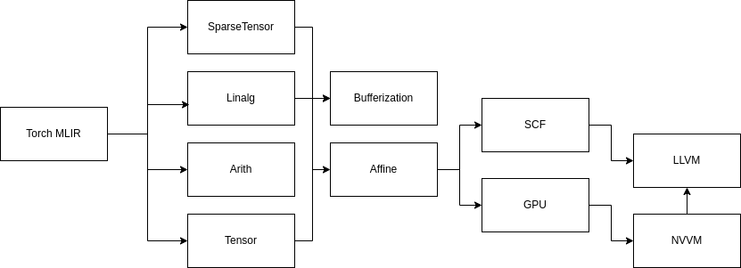

## Spartify
MLIR-based compiler to exploit the essence of sparsity to improve the performance in the modern-day GPUs via PTX & SPIRV



## Supported Sparse Structure
- support for N:M (2:4) Structured Sparsity

## Build Instruction 
```
$ export MLIR_DIR=~/Edge_ai/llvm-project/build/lib/cmake/mlir
$ mkdir build && cd build 
$ cmake ..
$ make 
```